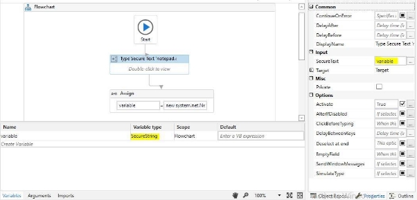

# ROBOTIC PROCESS AUTOMATION

**Practical No. 1**

1. **Create a simple sequence-based project.**

**Print message hello**

Step 1: Open a UiPath studio.

Step 2: Select blank process and give a name to create a project.

Step 3: Click on open main workflow.

Step 4: In activity panel search sequence and select sequence and drop in main workflow. Step 5: Now search for message box and select message box and drop in main workflow.

Step 6: In message box type hello world. Step 7: click on debug file and select run file.

**Output:**

2. **Create a flowchart-based project.**

Step 1: Open UiPath studio and click on process give name to your project.

Step 2: Click on Open main workflow. Drag and drop flowchart from activities panel.

Step 3: Drag and drop input dailog box inside a flowchart. Step 4: Create a variable “clgname” and give your input label

Step 5: Drag and drop a message box below input dialog box and enter your message inside message box.

Step 6: Click on debug file and select run file.

**Output:**

Input dialog box

Actual Output

3. **Create an UiPath Robot which can empty a folder in Gmail solely on basis of recording.**

Step 1: We begin with a blank project in UiPath Studio and then choose Web recorder from the Recording drop-down list:

Step 2: Use the Record function.

Step 3: Notice Open Browser between Record and Click; this is available with web recorder to record steps in browser-based applications.

Step 4: Go to gmail.com

Step 5: Go to trash

Step 6: Empty trash

**Output:**

**Practical 2**

1. **Automate UiPath Number Calculation (Addition,Subtraction, Multiplication, Division of numbers).**

Step 1: Open UiPath studio select process and give name to your project and click on create.

Step 2: Click on open main workflow

Step 3: go to activities and select sequence drag and drop.

Step 4: Create 4 integer variable.

Step 5: Select 2 input dialogs from the activities drag and drop. Enter the values in dialog box.

 

Step 6 : Select another dialog box for selecting options

` `

Step 7: Select switch activity and assign each case, required condition

Step 8: Repeat the same step as below for all the case.

Step 9: Click on debug file and click on run file: **Output:**

**a**

**b**

**c**

**d.**

2. **Create an automation UiPath project using different types of variables (number, datetime, Boolean, generic, array, data table)**

Number:

Step 1: Create a blank project and give it a meaningful name.

Step 2: Drag and drop the Sequence activity and give it a name.

Step 3: Create two variables named variable1 and variable2 of int32.

Step 4: Create another variable named Result of int32.

Step 5: Select the Assign activity and assign the variable1 as “5”.

Step 6: Select the Assign activity and assign the variable2 as “10”.

Step 7: Select the Assign activity and assign the Result as “variable1+variable2”. Step 8: Select the Write Line activity and print the Result value.

Step 9: Run.

String:

Step 1: Create a blank project and give it a meaningful name.

Step 2: Drag and drop the Sequence activity and give it a name.

Step 3: Create two variables named String1 and String2 of String.

Step 4: Select the Assign activity and assign the String1 as “Robotic Process”. Step 5: Select the Assign activity and assign the String2 as “Automation”.

Step 6: Select the Write Line activity and perform the concatenation method in it. Step 7: Run.

**Output:**

DateTime:

Step 1: Create a blank project and give it a meaningful name.

Step 2: Drag and drop the Sequence activity and give it a name.

Step 3: Create a variables named Date1 of String.

Step 4: Select Assign activity and assign “Now.ToString” to the variable Date1.

Step 5: Select Write Line activity and Print the above.

Step 6: Select Assign activity and assign “Now.ToShortDateString” to the variable Date1. Step 7: Select Write Line activity and Print the above.

Step 8: Select Assign activity and assign “Now.ToShortTimeString” to the variable Date1. Step 9: Select Write Line activity and Print the above.

Step 10: Run.

**Output**

Boolean:

Step 1: Create a blank project and give it a meaningful name.

Step 2: Drag and drop the Sequence activity and give it a name.

Step 3: Create a variables named Boolean1 of Boolean.

Step 4: Select Assign activity and assign “1<2” to the variable Boolean1. Step 5: Select Write Line activity and Print the above.

Step 6: Run.

**Output**

Generic:

Step 1: Create a blank project and give it a meaningful name.

Step 2: Drag and drop the Sequence activity and give it a name.

Step 3: Create a variables named Generic1 of GenericValue.

Step 4: Select Assign activity and assign “1” to the variable Generic1.

Step 5: Select Write Line activity and Print the above.

Step 6: Select Assign activity and assign “Robotic Process Automation” to the variable Generic1. Step 7: Select Write Line activity and Print the above.

Step 8: Select Assign activity and assign “Now” to the variable Generic1.

Step 9: Select Write Line activity and Print the above.

Step 10: Run.

**Output:**

Array:

Step 1: Create a blank project and give it a meaningful name.

Step 2: Drag and drop the Flowchart activity and give it a name.

Step 3: Drag and drop the Sequence activity and give it a name.

Step 4: Create a variable named array of int32.

Step 5: Select the Assgin activity and assign the value {1,2,3,4,5} to the variable named array. Step 6: Select the For Each activity.

Step 7: Set values as “For Each item in array”.

Step 8: Inside the body of For Each select the Write Line activity and enter text “item.toString”. Step 9: Run.

**Output**

DataTable:

Step 1: Create a blank project and give it a meaningful name. Step 2: Drag and drop the Flowchart activity and give it a name. Step 3: Drag and drop the Sequence activity and give it a name. Step 4: Create a variable named DataTable1 of DataTable.

Step 5: Select Build Data Table activity and create a DataTable.

Step 6: Set output value as “DataTable1”.

Step 7: Select Output Data Table and set the input value as “DataTable1”.

Step 8: Set a variable “OutputDataTable1” for output value. You can use ctrl+k to create a variable. Step 9: Select a Message Box and set the value as “OutputDataTable1”.

Step 10: Run.

**Output**

` `

**Practical 3**

1. **Create an automation UiPath Project using decision statements. If-else Activity**

Step 1: Create a blank project and give it a name.

Step 2: Drag and drop the Flowchart activity and give it a name. Step 3: Create a variable name for storing user input.

Step 5: Drag and drop input dialog box.

Step 6: Drag and drop if activity and give the condition.

Step 7: Drag and drop message box inside if activity for displaying the output.

Step 8: Run.

**Output:**

**Result of activity:**

2. **Create an automation UiPath Project using looping statements.**

**For Each Loop**:

Step 1: Create a blank project and give it a meaningful name.

Step 2: Drag and drop the Flowchart activity and give it a name.

Step 3: Drag and drop the Sequence activity and give it a name.

Step 4: Create a variable named array of int32.

Step 5: Select the Assign activity and assign the value {1,2,3,4,5} to the variable named array. Step 6: Select the For Each activity.

Step 7: Set values as “For Each item in array”.

Step 8: Inside the body of For Each select the Write Line activity and enter text “item.toString”. Step 9: Run.

**Output:**

**Practical 4**

1. **Automate any process using basic recording.**

**Emptying gmail activity using task recording.**

Step 1: Open UiPath studio. select process and give name to your project.

Step 2: Click on open main workflow..

Step 3: Open gmail in chrome.

Step 4: Click on recording and select basic recording

Step 5 : Select on record

Step 6: In gmail, go to trash and empty the bin Step 7 : Click on save and exit

Step 8 : Run the file

**Output:**

2. **Automate any process using desktop recording.**

**Writing and Calculation operation using desktop recording**

Step 1: Open UiPath studio. select process and give name to your project.

Step 2: Click on open main workflow. Click on new select flowchart. Step 4 : Open notepad and calculator

Step 3 : Open recording and click on desktop recording

Step 4: click on recording and Start to record.

Step 5: Type message on the calculator.

Step 6: Perform a simple calculation in the calculator.

Step 7: Save and exist the recorder.

Step 8: Run the file

**Output:**

Main workflow

 

Attach Window activity of notepad

Attach Window activity of calculator

 

Output of notepad activity Output of Calculator activity

3. **Automate any process using web recording.**

    **Navigating between pages.**

    Step 1 : Open uipath studio give name to your project. Step 2: Click on main workflow.

    Step 3: Open any browser and keep

    Step 4: Click on recorder and select web recorder.

    Step 5: Go to browser type “sies college of commerce and economics”. Go to the home page and browse to any subpage.

    Step 6: Save and exit the recorder. Step 7: Run the file

    **Output**

**Practical 5**

1. **Consider an array of names. We have to find out how many of them start with the letter "a". Create an automation where the number of names starting with "a" is counted and the result is displayed.**

Step 1: Open uipath studio and give name to your project.

Step 2: Click on open main workflow. click on new and select sequence.

Step 3 : Select a flowchart and drag and drop multiple assign activity in it.

Step 4: Create 2 variables. One for storing the array of names and other for counting the number of names in array.

Step 5: Drag and drop for each activity

Step 6: Inside the body section of for each activity, drag and drop if activity and give the condition for counting the number of occurrence of character ‘a’.

Step 7: Drag and drop a message box below for each activity. Enter the value to be displayed in the message box.

**Output:** Flow of Activity

Result

**Practical 6**

**a.Create an application automating the read, write and append operation on excel file.**

1. **Read cell:**

Step 1 : Drag and drop a flowchart activity.

Step 2: Drag and drop read range activity.

Step 3: Specify the path of excel sheet, sheet name as well as the range of cells to read.

Value in excel:

Step 4: Create a variable of type “string” to hold the read data.

Step 5: Create a datatable variable “MyDataTable” of DataTable type.

Step 6: Set the output of Read Range activity to MyDataTable

Step 7: Drag and drop Output Data table activity

Step 8: Select the Activity Output Data Table and set its input to “mydatatable” and output to “result”

Step 9: Select Message Box activity and configure it to display the “Result” variable contents. Step 10: Run the file.

**Output:**

2. **Write cell:**

Step 1 : Drag and drop a flowchart activity.

Step 2: Select activity “Build Data Table” and enter some data into it

Step 3: Create a data table variable MyDataTable MyDataTable of DataTable type Step 4: Set the output of Build Data Table activity to MyDataTable

Step 5: Select Excel Application Scope .Specify the path of the excel sheet Step 6: Select Write Range Activity.

Step 7: Specify the sheet name and range of cells to write

Step 8: Set the data table value to MyDataTable

Step 9: Run **Output:**

3. **Append range:**

Step 1 : Drag and drop a flowchart activity.

Step 2: Select activity “Build Data Table” and enter some data into it

Step 3: Create a data table variable MyDataTable MyDataTable of DataTable type Step 4: Set the output of Build Data Table activity to MyDataTable

Step 5: Select Excel Application Scope .Specify the path of the excel sheet

Step 6: Select Append Range Activity.

Step 7: Specify the sheet name and range of cells to write

Step 8: Set the data table value to MyDataTable

Step 9: Run **Output:**

2. **Automate the process to extract data from an excel file into a data table and vice versa. **

**i.Extracting data from excel to another other**

Step 1 : Drag and drop a flowchart activity.

Step 2: Select Read Range Activity.

Step 3: Specify the path of the excel sheet as well as the sheet name and range of cells to read

Step 4: Create a data table variable MyDataTable of DataTable type and Create a variable of type “string” to hold the read data.

Step 5: Set the output of Read Range activity to MyDataTable

Step 6: Select the Activity Output Data Table and set its input to “mydatatable” and output to “result” Step 7: Select Excel Application Scope.Specify the path of an empty excel sheet

Step 8: Select Write Range Activity. Specify the sheet name and range of cells to write.

Step 9 :Set the data table value to MyDataTable

Step 10:Run the file

**Output:**

Data extracted from excel 1 to excel 2:

**ii. Extracting data from DataTable to Excel**

Step 1 : Drag and drop a flowchart activity.

Step 2: Select activity “Build Data Table” and enter some data into it

Step 3: Create a data table variable MyDataTable MyDataTable of DataTable type Step 4: Set the output of Build Data Table activity to MyDataTable

Step 5: Select Excel Application Scope .Specify the path of an empty excel sheet Step 6: Select Write Range Activity.

Step 7: Specify the sheet name and range of cells to write

Step 8: Set the data table value to MyDataTable

Step 9: Run **Output:**

**Practical 7**

1. **Implement the attach window activity.**

Step 1. Create a blank project and give it a meaningful name.

Step 2: Drag and drop a Sequence activity on the Designer panel. Also, drag and drop a Click activity inside the Designer panel.

Step 3 : Open a notepad

Step 4: Double-click on the Click activity and then click on Indicate on screen.

Locate the Notepad icon.

Step 5: Drag and drop the Attach Window activity on the main Designer panel.

Step 6: Double-click on the Attach Window activity. Click on Click Window on Screen and indicate the Notepad window

**Output:**

2. **Find different controls using UiPath.**
1. **Anchor Base**

Step 1: Go to[ http://www.rpachallenge.com/ ](http://www.rpachallenge.com/)

Step 2: Go to uipath studio. Drag and drop a Flowchart activity on the Designer panel of a blank project. Also, drag and drop an Anchor base control from the Activities panel.

Step 3: Double click on the Anchor base control.

Step 4: Drag and drop Find element and Type into activity inside anchor base control.

Step 5: In Find Element Select the “Role in Company” using Indicate on Screen.

Step 6: In Type into Select input box of “Role in Company” and in text add your name.

Step 7: Select Run **Output:**

2. **Element Exists.**

Step 1: Go to uipath studio.

Step 2 : Drag and drop sequence activity into the designer panel.

Step 3: Drag and drop open browser activity into the sequence.

Step 4: Give URL as[ https://www.google.co.in/.](https://www.google.co.in/)

Step 5 : Below that drag and drop the Element Exist activity

Step 6: Click on indicate on screen and click on the logo of “google”.

Step 7: In properties, define Output>Exists:Elementfound (By ctrl+k in order to create variable.

Step 8 : Drag and drop **if activity** below the Element exist activity.

Step 9: In Then section drag and drop the Type into activity.

Step 10 : Click on indicate on screen, click on the search bar and type anything you want to search. Step 11: Below that drag and drop the **click activity,** Indicate on screen click on “google search button”.

Step 12: Now in else section drag and drop the **message box** and type “element doesn’t exist”. Step 13: Now run the file.

**Output:**

Overview of workflow

**3.Find Children**

Step 1: Goto[ https://www.spicejet.com/ i](https://www.spicejet.com/)n the browser.

Step 2: Drag and drop the flowchart into the designer panel.

Step 3: Now drag and drop the **Find Children** Activity.

Step 4: At Indicate on screen click on “Departure City”(in homepage of spicjet). Step 5: In properties> children:Places.(creating variable using ctrl+k)

Step 6: Drag and drop the **For Each** Activity.

Step 7: Double click on it. Type ForEach “item” in “**Places**”.

Step 8: Now in Properties do the changes. Type argument**:UiPath.Core.UiElement**(Inorder to get that click on “Browse on types” and search for it)

Step 9: Now drag and drop the **get attribute** to the Body. Now do the changes in the properties. Also create the output as resultdata.(using ctrl +k to create variable)

Step 10 :Drag and drop the Log message below the get attribute.

Step 11: Finally Drag and drop the message box activity below foreach activity. Double click on it. Type Places.Count().ToString.

Step 12: Run the file **Output:**

Inside look of each activity present in flowchart.

**Output:**

**4.Find Element**

Step 1: Drag and drop the flowchart to the designer panel.

Step 2: Now drag and drop the **open browser** activity.

Step 3: Give the url as[ https://www.google.com/?gws_rd=ssl#spf=1611294141178. ](https://www.google.com/?gws_rd=ssl&spf=1611294141178)

Step 4: Drag and drop the **Find Element** activity.

Step 5: In Properties>Output, **FoundElement:element**(using ctrl+k for creating the variable)

Step 6: Below **Find Element** Activity drag and drop the **message box** activity. Type as “Element exists”.

Step 7. Run the file.

**Output**

Workflow:

**Result :**

**5. Find Relative Element**

Step 1: Drag a Sequence. Create the following variable:

Step 2: Drag an **OpenApplication** activity inside the Sequence container.

Step 3: Inside the activity, click the Indicate window on screen option. Then you can select the Notepad window.

Step 4: Drag a Find Element activity below the **OpenApplication** activity.

Step 5: Inside the activity, click the Indicate window on screen option. Then you can select the

“Edit” option in the notepad.

Step 6: In the Properties panel, select the COMPLETE option from the WaitForReady drop-down list.

\- Add the variable EditElement in the FoundElement field.

Step 7 : Place a Find Relative activity below the Find Element activity.

Step 8: In the Properties panel, add the value 20 in the OffsetX field. Select the option TopRight from the Position drop-down list. Add the variable Editelement in the Element field. Add the variable Formatelement in the RelativeElement field.

Step 9: Place a Click activity below the Find Relative activity.

Step 10: In the Properties panel, add the variable FormatElement in the Element field. Select the None option from the KeyModifiers drop-down list.

Step 11: Place another Click activity below the first Click activity.Inside the activity, click the Indicate on screen option.Click on “font” (Using f2 button).

Step 12: Drag an Activate activity below the Click activity. Inside the activity, click the Indicate on screen

option. Click on entire font window.

Step 13: Place a Set Focus activity below the Activate activity. Inside the activity, click the Indicate on screen option, and select the Size menu option from font window of the notepad.

Step 14: Drag a Send Hotkey activity below the Set Focus activity. In the Key field, type the value down.

Step 15: In the Properties panel, select the check box for the Activate option. This option brings the UI element to the foreground and activates it before the text is written.

Step 16: Select the None option from the KeyModifiers drop-down list.

Step 17: Select the check box for the SpecialKey option. This indicates that you are using a special key in the keyboard shortcut.

Step 18: Place a Click activity below the Send Hotkey activity. Inside the activity, click the Indicate on screen option. Click on OK button of the font window of notepad.

Step 19: Run the file.

**Output**

**6.Indicate on screen**

Step 1.Drag and drop the **sequence activity** into the designer plane. Step 2.Place **indicate on screen** into the **sequence** activity.

**Output:**

3. **Demonstrate the following activities in UiPath:**

.**i. Mouse (click, double click and hover)**

1. Click Activity

Step 1: Go to uipath studio

Step 2: Click on Workflow and Drag Flow Chart from Activities panal.

Step 3: Double Click on FlowChart.

Step 4 : Drag and drop the Click activity

Step 5: Double click on click activity.

Step 6: Click on indicate on screen and indicate the UI element you want to click on. Step 7: Now click on run.

**Output:**

2. Double Click Activity

Step 1: Go to uipath studio

Step 2: Click on Workflow and Drag Flow Chart from Activities panal.

Step 3: Double Click on FlowChart.

Step 4 : Drag and drop the Double Click activity

Step 5: Double click on double click activity.

Step 6: Click on indicate on screen and indicate the UI element you want to click on. Step 7: Now click on run.

**Output:**

3. Hover Activity

Step 1: Go to uipath studio

Step 2: Click on Workflow and Drag Flow Chart from Activities panal.

Step 3: Double Click on FlowChart.

Step 4 : Drag and drop the Hover activity

Step 5: Double click on hover activity.

Step 6: Click on indicate on screen and indicate the UI element you want to click on. Step 7: Now click on run.

**Output:**

**ii Type into**

Step1: Add a new sequence and name it as Type into Activity

Step2: Search for Type into Activity in the activity panel and drag it inside the sequence. Step3: Click on Indicate on Screen and indicate the pointer towards notepad editor. Step4: Type the message to be printed on the notepad in the editable text section

Step5: Hit the Run Button to see the results.

**Output:**

**iii Type secure text**

Step1: Add a new flowchart

Step2: Search for Type secure text Activity in the activity panel and drag it inside the sequence. Step3: Click on Indicate on Screen and indicate the pointer towards notepad editor.

Step4: Create a variable of type “securestring” and assign it to SecureText property in the properties. Step5:Drag and drop a assign activity.

Step6: Assign the variable created with this value

“new system.net.NetworkCredential(String.Empty,"Test@123").SecurePassword”

Step5: Hit the Run Button to see the results.

**Output:**

**Practical 8**

**a.Demonstrate the following events in UiPath:**

1. **Element Trigger**

**On click element**

Steps1: Click on user events select on click element

Step 2: Single click on icon present in the toolbar.

Step 3: Drag and drop message box inside event handler. Step 4: Write any message you want to display.

Step 5: Run the file.

Step 6: Click the icon which you selected in user event. **Output:**

![ref1]

Name: Monika Dongare Roll No.:05 Page no 54
ROBOTIC PROCESS AUTOMATION

**On key press event**

Steps1: Click on user events select on key press element Step 2: Indicate on screen and select the key.

Step 3: Drag and drop message box inside event handler. Step 4: Write any message you want to display.

Step 5: Run the file.

Step 6: Click the key which you selected in user event. **Output:**

![ref2]

2. **Image trigger**

Steps1: Click on user events select on click image element Step 2: Single click on any image present in the screen. Step 3: Drag and drop message box inside event handler. Step 4: Write any message you want to display.

Step 5: Run the file.

Step 6: Click the image which you selected in user event. **Output:**

![ref1]

3. **System trigger**

Steps1: Click on user events select on monitor keyboard element Step 2: Select any key.

Step 3: Drag and drop message box inside event handler.

Step 4: Write any message you want to display.

Step 5: Run the file.

Step 6: Click the key which you selected in user event. **Output:**

![ref2]

**b. Automate the following screen scraping methods using UiPath Full Test**

Step1: First we select a new project and give it a name.

Step2: Take a sequence chart in the designer panel.

Step3: Open the notepad and put some text.

Step 4: Select the screen scrapping and select the scrapping method.

Step 5: Drag and drop a message box and give the variable name automatically created.

Step 7: Run the file.

**Output:**

**Native**

Step1: First we select a new project and give it a name.

Step2: Take a sequence chart in the designer panel.

Step3: Open the notepad and put some text.

Step 4: Select the screen scrapping and select the scrapping method.

Step 5: Drag and drop a message box and give the variable name automatically created.

Step 7: Run the file. **Output:**

**OCR**

Step1: First we select a new project and give it a name.

Step2: Take a sequence chart in the designer panel.

Step3: Open the notepad and put some text.

Step 4: Select the screen scrapping and select the scrapping method.

Step 5: Drag and drop a message box and give the variable name automatically created.

Step 7: Run the file. **Output:**

Name: Monika Dongare Roll No.:05 Page no 61

[ref1]: Aspose.Words.01000769-2a78-411d-8bec-f2089b05d5af.111.png
[ref2]: Aspose.Words.01000769-2a78-411d-8bec-f2089b05d5af.113.png
